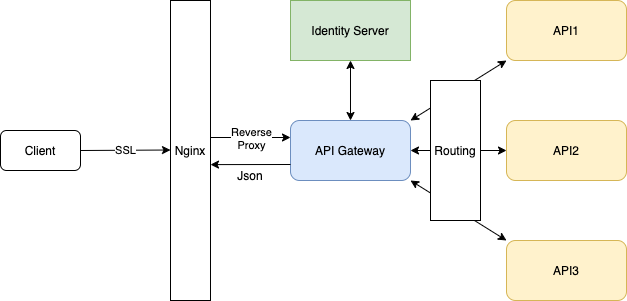

# .Net Core로 API Gateway 개발
  > `1. Request Url을 분석하여 엔드포인트 체크`
  > `2. 엔드포인트에 맞는 라우팅 경로 정보 획득`
  > `3. 인증이 필요한 서비스의 경우 인증 서버에 토큰 체크`
  > `4. API 서비스와 http 통신을 통해 응답 결과 회신`
  > `※ 라우팅 정보는 DB에 저장하고 프로그램 실행 시 일괄 Select`

<hr/>

## #. 구조


<hr/>

## 1. Web API 프로젝트 생성
 - Example 폴더 생성 >> ``` mkdir Example ```
 - 닷넷 커맨드를 이용해 프로젝트 생성 >> ``` dotnet new webapi ```

## 2. 라우팅 미들웨어 추가
 - Startup.cs
```
    app.UseMiddleware<RouteMiddleware>();
```

## 3. 라우트 인터페이스 상속
 - IRoute.cs
```
    public interface IRoute
    {
        Task Invoke(HttpContext context);
    }
```
 - RouteMiddleware.cs
```
    public RouteMiddleware(RequestDelegate next, ILogger<RouteMiddleware> log)
    {
        _next = next;
        _log = log;

        routes = new Dictionary<string, IRoute>
        {
            { "/api", new Route() },
            { "/", new Default() }
        };
    }

    public async Task Invoke(HttpContext context)
    {
        var endPoint = GenerateEndPoint(context.Request.Path.Value);

        if (routes.TryGetValue(endPoint, out IRoute route))
            await route.Invoke(context);
        else
            await _next.Invoke(context);
    }
```